Дана следующая задача:

Рассмотрим движение на перекрестке. На нем находится несколько светофоров, регулирующих

движение автомобилей (4 шт), и несколько - движение пешеходов по переходам (8 шт):

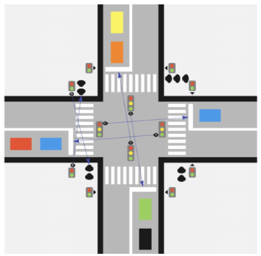

У пешеходных светофоров 2 состояния, у автомобильных - 3 В каждый светофор встроена

камера, которая фиксирует количество автомобилей/пешеходов в той очереди, для которых

светофор установлен. Это очередь на противоположной стороне пешехода/перекрестка (см

рисунок). Автомобили при проезде перекрестка едут либо прямо, либо направо. Люди и

автомобили осуществляют переход или проезд перекрестка по одному, уменьшая размер

соответствующей очереди на 1

Каждый светофор имеет уникальный id. Светофоры могут общаться при помощи событий, отсылая

события друг другу по id. Пересылаемые события - это некоторые контейнеры с данными

(например, там может лежать количество людей/автомобилей в очереди, id отправителя, текущее

состояние светофора). Светофор может взводить таймер, который через заданное время

отсылают заданное событие на заданный id. Отправка события - это помещение контейнера в

очередь событий для светофора, у каждого светофора очередь своя собственная. Светофоры

обрабатывают события параллельно, независимо от друг от друга. При этом каждый светофор

обрабатывает свои события последовательно, в том порядке, в каком они помещаются в очередь.

Светофор может получить информацию о текущем состоянии любого другого светофора

синхронно (не через событие).

Задача: придумать и описать адаптивный алгоритм работы светофоров для

оптимизации общей пропускной способности перекрестка в зависимости от ситуации

на перекрестке.

Системно задачу можно разделить на бэк и фронт составляющие. Бэк отвечает за хранение и обработку информации о траффике. Фронт отвечает за отрисовку всех вычислений в интерфейс для возможности анализа и интерпретации результатов.

Определим основные элементы задачи и логику их применения.

Состояние светофора выделено в enumeration TrafficLightState. Выделим три состояния светофора: красный, желтый и зеленый цвета. Цвет является информацией, которая хранится внутри структуры TrafficLightInfo. Эта структура включает в себя id (номер светофора), state (состояние/цвет светофора) и queueCounter (счетчик текущей очереди) (рисунок ниже).

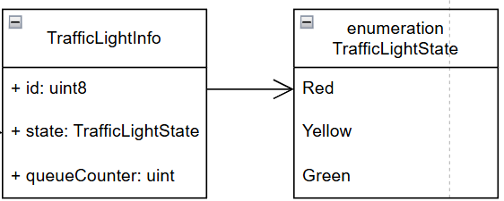

Из описанных структур можно определить интерфейсный класс ITrafficLight, который будет определять основные методы, которые могут понадобиться в контроле траффика на перекрестке (рисунок ниже).

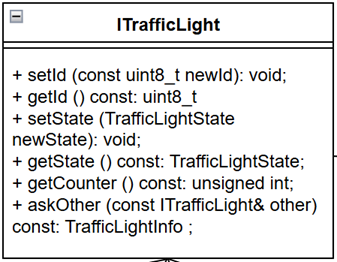

От интерфейсного класса можно создать классы CarTrafficLight и PedestrianTrafficLight, которые переопределяют методы базового класса для контроля автомобильного и пешеходных потоков соответственно.

Светофоры в решении рассматриваются, как часть конфигурации определенного типа перекрестка, который является контроллером выполняемых заданий по мониторингу и контролю траффика. Для этого был определен базовый класс ICrossroad с одним методом trafficControl, а также его наследник CrossroadXType, который отвечает за соответствующую конфигурацию перекрестка, которая приведена в задаче. В качестве полей класс CrossXType определены массивы со светофорами ptls и ctls, а также контейнеры с очередями авто и пешеходов Cs и Ps.

Классы Car и Pedestrian были добавлены как фиктивные структуры, которые в рамках решения были выделены в отдельный тип, но их внутренняя реализация в рамках задачи нерелевантна.

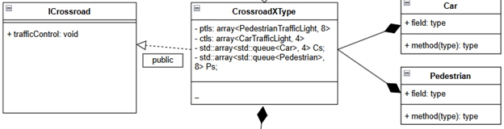

Последним был реализован метод для фронтэнда, который отвечает за отрисовку симуляции траффика.

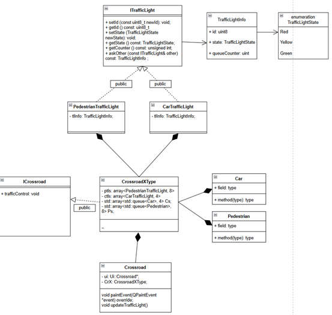

С учетом имеющихся условий проезда перекрестка было выделено 7 возможных состояний светофоров, которые были выделены в соответствующие методы в классе CrossroadXType.
|||
|---|---|
| state1() | 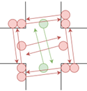 |
| state2() | 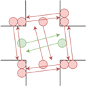 |
| state3() | 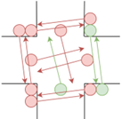 |
| state4() | 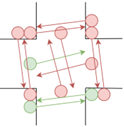 |
| state5() | 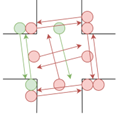 |
| state6() | 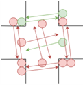 |
| state7() | 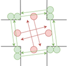 |

Каждая стрелка указывает в сторону того, кому можно двигаться.

Нумерация внутри контейнеров со светофорами была организована, как на картинке ниже.

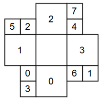

Каждый автомобильный светофор разрешает авто напротив себя двигаться к себе (прямо) или повернуть в сторону светофора слева от себя (авто поворачивает направо).

Каждый пешеходный светофор разрешает пешеходу двигаться к себе.

Для реализации контроля траффика в методе controlTraffic() создаются 4 потока.

Первый поток создается для имитации добавления во все очереди пешеходов или авто:

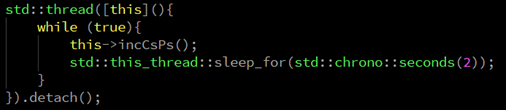

Второй и третий потоки отдельно имитируют управление уменьшения очередей:

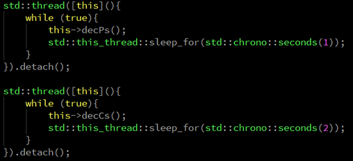

Для имитации потоков авто и пешеходов мы считаем, что авто или пешеход добавляются в каждую очередь случайным образом раз в 2 секунды. Также можно считать, что авто могут уменьшать размер очереди на 1 раз в две секунды, а пешеходы – на 1 раз в 1 секунду. В рамках задачи такая имитация может считаться уместной.

Четвертый поток контролирует определение одного из приведенных выше семи состояний.

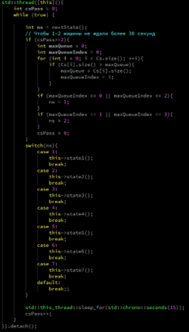

Следующее за текущим состояний выбирается с помощью поиска самой большой очереди авто и пешеходов, при этом каждое состояние должно продлиться, как минимум 15 секунд. Также алгоритм не допускает, чтобы авто на перекрестке стояли слишком долго, поэтому в случае слишком большого пешеходопотока и слишком малого автопотока (допустим, 1 авто с какой-либо стороны), алгоритм предпочтет хотя бы раз в 30 секунд пропустить автомобиль.

Для графической интерпретации работы алгоритма была реализована отрисовка состояний каждого светофора, а также счетчики с очередями. На картинке ниже приведено промежуточное состояние, когда все светофоры красный, а также стрелками от каждого счетчика отмечено, в какую сторону от него будет двигаться автомобиль или пешеход.

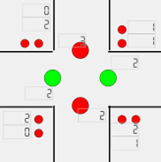

Другие состояния:

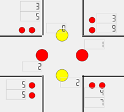
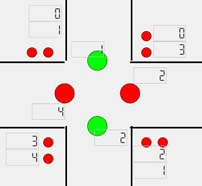
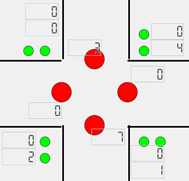
